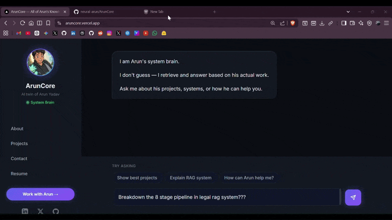

## Arun Yadav
### Freelance AI Systems Engineer — Healthcare & Medical Education

I build AI systems that work under real constraints, not just in demos.

My focus is healthcare and medical education — two domains I understand from the inside.
I spent years preparing for NEET. That experience taught me exactly where students get stuck,
where information is buried, and where hours are wasted. Now I build tools that fix that.

---

### 🤖 Talk to My AI Before Reading My Resume

> **[aruncore.vercel.app](https://aruncore.vercel.app)**

Instead of reading a static resume, ask my AI directly:
- *"What has Arun built?"*
- *"Is Arun the right fit for my project?"*
- *"What is his experience with RAG systems?"*

Built with hybrid retrieval, conversational memory, and lead capture.
This is not a template. It is a production system — and it is the best demonstration of what I build.

---

### What I Build

- **RAG Pipelines** — accurate retrieval from large medical document sets, textbooks, PYQs
- **Healthcare AI Tools** — clinical workflow automation, documentation assistants
- **Medical Education Systems** — AI tutors, MCQ generators, personalized learning tools
- **Document Intelligence** — any domain with heavy PDF and text load

---

### Current Stack

**AI & Retrieval:** LangChain · LangGraph · ChromaDB · Pinecone · HuggingFace · LLM Evaluation

**Backend:** Python · FastAPI · AsyncIO · Pydantic · SQLAlchemy

**Automation:** Playwright · Aiohttp · Structured Data Extraction

**Deployment:** Render · Vercel · HuggingFace Spaces · Git

---

### Other Projects

| Project | What it does |
|---|---|
| **Legal RAG System** | Domain-aware retrieval for Indian legal documents with citation-grounded responses |
| **Real Estate Scraper Suite** | Async browser + HTTP extraction for Cloudflare-protected workflows |
| **Personal AI Agent** | FastAPI-based agent with tool-calling, memory, and model fallback handling |

---

### How I Work

- Truth over guessing — responses stay grounded in real data
- Reliability over hype — systems that work repeatedly under messy real-world conditions
- Build-first — real understanding comes from shipping, debugging, and fixing live systems

---

### Open For

Freelance projects in healthcare, medical education, and document-heavy AI systems.

If you are building in this space or need a reliable AI system built on your data — reach out.

---

### Connect

